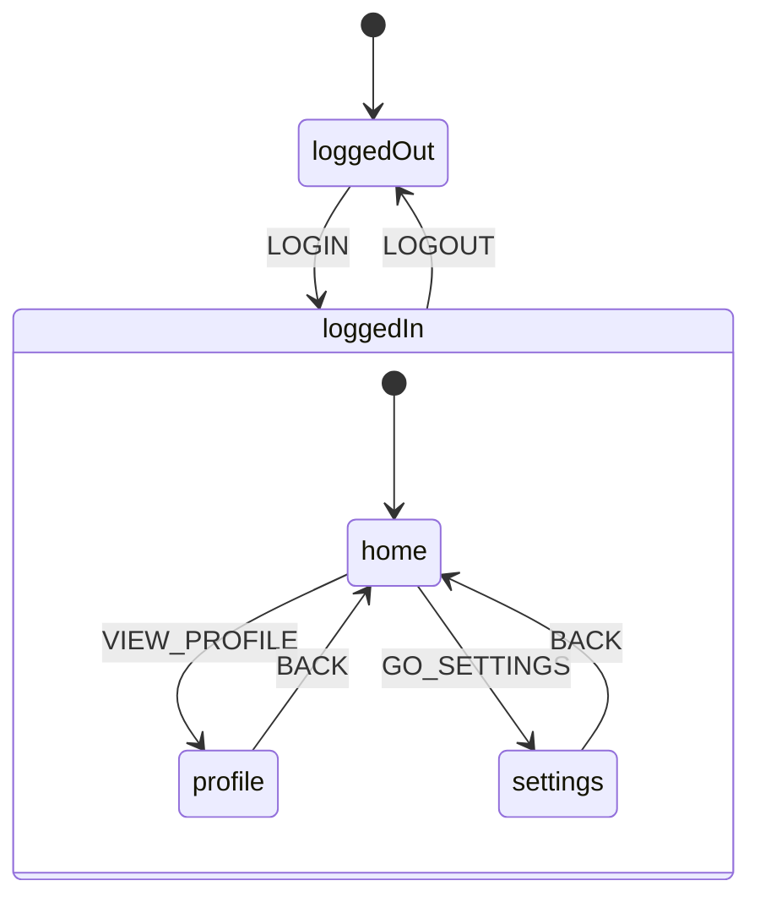

# Step 10: Navigator 2.0 Integration

Demonstrates **Navigator 2.0** integration with state machines for declarative, state-driven navigation with full control over page transitions and deep linking.

## Run

```bash
cd tutorial/step10_navigator
flutter run -d chrome
```

## Concepts Introduced

- **State-to-Route Mapping** - Declarative mapping between state machine states and URL paths
- **Custom Page Transitions** - Fade, slide, scale, and custom animations per route
- **Deep Linking** - URL parameters that trigger state machine events
- **Route Guards** - Prevent navigation based on state (e.g., require authentication)
- **Redirects** - Automatic redirect when guards fail

## How to Use

1. Click **Sign In** to authenticate (transitions from `/login` to `/home`)
2. Click on a profile to navigate to `/profile/:id` with slide transition
3. Click **Settings** to open modal (slide from bottom transition)
4. Toggle dark mode in settings to see theme change
5. Click **Sign Out** to return to login (with fade transition)
6. Try navigating directly to `/profile/1` while logged out (redirects to `/login`)

## State Machine Structure



```
app
├── loggedOut                    → /login (fade)
│   └── LOGIN → loggedIn.home
└── loggedIn (compound)
    ├── home                     → /home (slide from right)
    │   ├── VIEW_PROFILE → profile
    │   └── GO_SETTINGS → settings
    ├── profile                  → /profile/:profileId (shared axis)
    │   └── BACK → home
    └── settings                 → /settings (modal/slide up)
        ├── BACK → home
        └── CHANGE_THEME → settings (self)
```

## Code Highlights

### Route Configuration

```dart
final routes = [
  StateRouteConfig<AppContext, AppEvent>(
    stateId: 'loggedIn.profile',
    path: '/profile/:profileId',
    pageBuilder: (context, snapshot, params) => StateMachinePage(
      key: ValueKey('profile-${params['profileId']}'),
      stateId: 'loggedIn.profile',
      child: ProfileScreen(profileId: params['profileId'] ?? ''),
      transitionBuilder: StateMachineTransitions.sharedAxisHorizontal,
    ),
    // Deep linking: URL params → state machine event
    paramsToEvent: (params, ctx) => ViewProfileEvent(params['profileId']!),
    // URL generation: context → URL params
    contextToParams: (ctx) => {'profileId': ctx.selectedProfileId ?? ''},
    // Guard: require authentication
    guard: (snapshot, params) => snapshot.context.isAuthenticated,
  ),
];
```

### Custom Transitions

```dart
// Fade transition (login page)
StateMachinePage.fade(
  stateId: 'loggedOut',
  child: LoginScreen(),
)

// Slide from right (home page)
StateMachinePage.slideFromRight(
  stateId: 'loggedIn.home',
  child: HomeScreen(),
)

// Modal slide from bottom (settings)
StateMachinePage.modal(
  stateId: 'loggedIn.settings',
  child: SettingsScreen(),
)

// Custom transition builder
StateMachinePage(
  stateId: 'profile',
  child: ProfileScreen(),
  transitionBuilder: StateMachineTransitions.sharedAxisHorizontal,
  transitionDuration: Duration(milliseconds: 350),
)
```

### Navigator Setup

```dart
final navigator = StateMachineNavigator<AppContext, AppEvent>(
  actor: actor,
  routes: routes,
  defaultPath: '/login',
  onNavigationEvent: (event) => print('Nav: ${event.type}'),
  onGuardRejected: (route) => print('Rejected: ${route.path}'),
);

MaterialApp.router(
  routerDelegate: navigator.routerDelegate,
  routeInformationParser: navigator.routeInformationParser,
);
```

### Guards and Redirects

```dart
StateRouteConfig(
  stateId: 'loggedIn.home',
  path: '/home',
  // Guard: only allow if authenticated
  guard: (snapshot, params) => snapshot.context.isAuthenticated,
  // Redirect: where to go if guard fails
  redirect: (snapshot, params) {
    if (!snapshot.context.isAuthenticated) {
      return '/login';
    }
    return null;  // No redirect, proceed normally
  },
)
```

### Deep Linking Flow

When user navigates to `/profile/123`:

1. `RouteInformationParser` parses URL and extracts `profileId=123`
2. `StateRouteConfig.paramsToEvent` converts to `ViewProfileEvent('123')`
3. Event is sent to state machine: `actor.send(ViewProfileEvent('123'))`
4. State machine transitions to `loggedIn.profile`
5. `pageBuilder` creates `ProfileScreen(profileId: '123')`

When state changes to profile:

1. `StateRouteConfig.contextToParams` extracts `profileId` from context
2. URL is updated to `/profile/123`
3. Browser history is updated for back/forward navigation

## Animation Patterns

For proper back animations, use **wildcard routes** to keep parent pages in the stack:

```dart
// Home stays in stack when navigating to Profile or Settings
StateRouteConfig(
  stateId: 'loggedIn.*',  // Wildcard matches all loggedIn.* states
  path: '/home',
  pageBuilder: (_, __, ___) => StateMachinePage.slideFromRight(...),
),

// Profile is added on top of Home
StateRouteConfig(
  stateId: 'loggedIn.profile',  // More specific, sorted after Home
  path: '/profile/:id',
  pageBuilder: (_, __, ___) => StateMachinePage.slideFromRight(...),
),
```

This creates a page stack: `[Home, Profile]` so when going back, Profile slides out revealing Home.

**Tip**: For "going back" feel on logout, use `slideFromLeft`:
```dart
StateRouteConfig(
  stateId: 'loggedOut',
  path: '/login',
  pageBuilder: (_, __, ___) => StateMachinePage(
    transitionBuilder: StateMachineTransitions.slideFromLeft,  // Feels like back
    ...
  ),
),
```

## Available Transitions

| Transition | Description |
|------------|-------------|
| `StateMachineTransitions.fade` | Fade in/out |
| `StateMachineTransitions.slideFromRight` | iOS-style push (forward) |
| `StateMachineTransitions.slideFromLeft` | Reverse push (back feel) |
| `StateMachineTransitions.slideFromBottom` | Modal style |
| `StateMachineTransitions.scale` | Scale with fade |
| `StateMachineTransitions.zoom` | Android-style zoom |
| `StateMachineTransitions.sharedAxisHorizontal` | Material 3 horizontal |
| `StateMachineTransitions.sharedAxisVertical` | Material 3 vertical |
| `StateMachineTransitions.none` | Instant (no animation) |
| `StateMachineTransitions.combine([...])` | Combine multiple |
| `StateMachineTransitions.slide(begin, end)` | Custom slide |

## Comparison: go_router vs Navigator 2.0

| Feature | go_router | Navigator 2.0 |
|---------|-----------|---------------|
| Transition control | Limited | Full control |
| Animation customization | Via CustomTransitionPage | Built-in transition builders |
| State machine integration | Via `refreshListenable` | Direct actor integration |
| Deep linking | Automatic | Configurable with guards |
| Dependencies | go_router package | Flutter core only |
