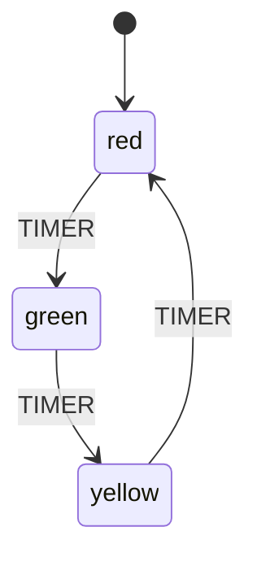

# Step 1: Traffic Light

Your first state machine - a simple traffic light that cycles through red, yellow, and green.

## Run

```bash
cd tutorial/step1_traffic_light
flutter run -d chrome
```

## Concepts Introduced

- **StateMachine.create** - Creating a state machine definition
- **States** - Defining atomic states (`red`, `yellow`, `green`)
- **Events** - Triggering transitions with events
- **Transitions** - Moving from one state to another
- **StateMachineProvider** - Providing the actor to widgets
- **StateMachineBuilder** - Building UI that reacts to state changes

## How to Use

Click the **TIMER** button to cycle through the traffic light states:
- Red → Green → Yellow → Red → ...

## State Machine Structure



```
trafficLight
├── red (initial)
│   └── TIMER → green
├── green
│   └── TIMER → yellow
└── yellow
    └── TIMER → red
```

## Code Highlights

### Defining the Machine

```dart
final trafficLightMachine = StateMachine.create<TrafficLightContext, TrafficLightEvent>(
  (m) => m
    ..context(const TrafficLightContext())
    ..initial('red')
    ..state('red', (s) => s..on<TimerEvent>('green'))
    ..state('green', (s) => s..on<TimerEvent>('yellow'))
    ..state('yellow', (s) => s..on<TimerEvent>('red')),
  id: 'trafficLight',
);
```

### Using in Flutter

```dart
StateMachineProvider<TrafficLightContext, TrafficLightEvent>(
  machine: trafficLightMachine,
  autoStart: true,
  child: StateMachineBuilder<TrafficLightContext, TrafficLightEvent>(
    builder: (context, state, send) {
      final isRed = state.value.matches('red');
      // Build UI based on state...
    },
  ),
)
```

### Checking Current State

```dart
state.value.matches('red')    // true if in 'red' state
state.value.matches('green')  // true if in 'green' state
```
