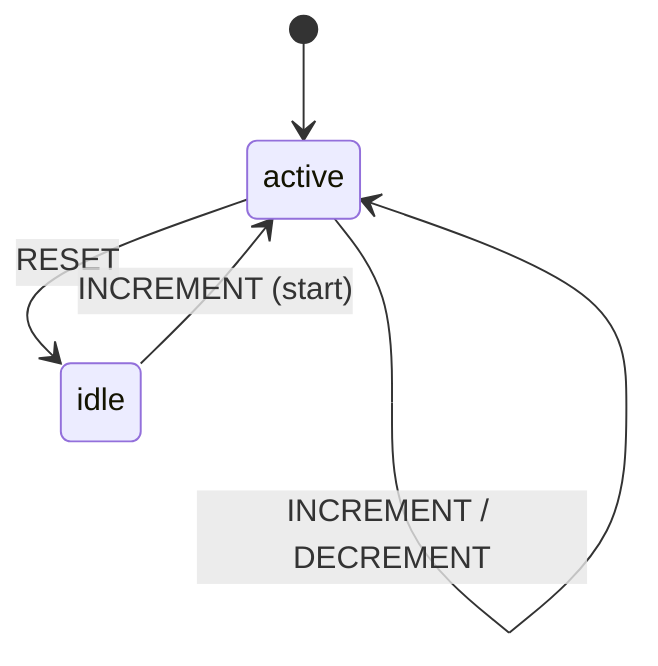

# Step 2: Counter

A counter with context (data) and actions - demonstrates how state machines can hold and modify data.

## Run

```bash
cd tutorial/step2_counter
flutter run -d chrome
```

## Concepts Introduced

- **Context** - Storing data (count, history) alongside state
- **Actions** - Functions that modify context on transitions
- **Entry Actions** - Actions that run when entering a state
- **Event Payloads** - Events can carry data (e.g., increment amount)
- **Multiple States** - `active` and `idle` states with different behaviors

## How to Use

- Click **+1** or **+5** to increment the counter
- Click **-1** or **-5** to decrement (only in active state)
- Click **RESET** to go to idle state (clears counter and history)
- From idle, clicking **+** starts the counter again

## State Machine Structure



```
counter
├── active (initial)
│   ├── INCREMENT → active (action: add to count and history)
│   ├── DECREMENT → active (action: subtract from count and history)
│   └── RESET → idle
└── idle
    ├── entry: [reset count and history to 0]
    └── INCREMENT → active (action: set count)
```

## Code Highlights

### Defining Context

```dart
class CounterContext {
  final int count;
  final List<String> history;

  const CounterContext({this.count = 0, this.history = const []});

  CounterContext copyWith({int? count, List<String>? history}) => ...
}
```

### Events with Payloads

```dart
class IncrementEvent extends CounterEvent {
  final int amount;
  IncrementEvent([this.amount = 1]);
}
```

### Actions that Modify Context

```dart
..on<IncrementEvent>('active', actions: [
  (ctx, event) {
    final e = event as IncrementEvent;
    return ctx.copyWith(
      count: ctx.count + e.amount,
      history: [...ctx.history, '+${e.amount}'],
    );
  },
])
```

### Entry Actions

```dart
..state('idle', (s) => s
  ..entry([
    (ctx, event) => ctx.copyWith(count: 0, history: []),
  ])
  // ...
)
```
