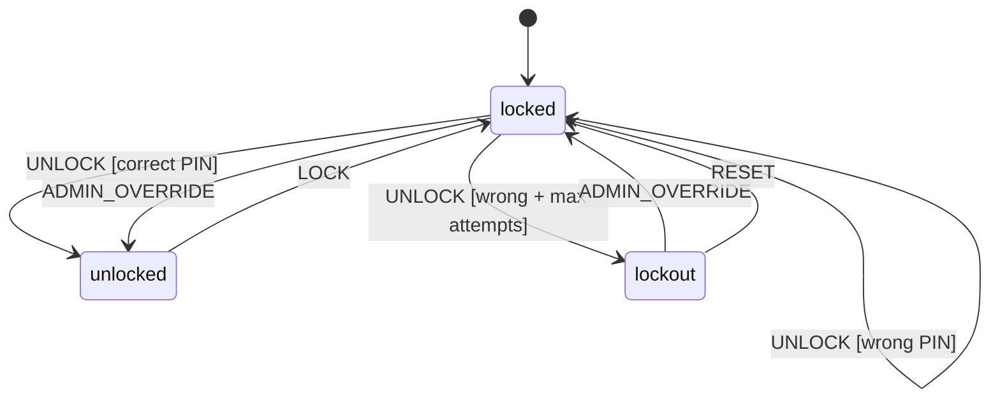

# Step 3: Door Lock

A door lock with PIN entry - demonstrates guards (conditional transitions) and multiple transition paths.

## Run

```bash
cd tutorial/step3_door_lock
flutter run -d chrome
```

## Concepts Introduced

- **Guards** - Conditional functions that allow/block transitions
- **Multiple Transitions** - Same event can lead to different states based on guards
- **Failed Attempt Tracking** - Context tracks security-related data
- **Lockout State** - Security pattern for too many failures

## How to Use

1. Enter a 4-digit PIN using the keypad
2. Press **OK** to submit
3. Correct PIN (`1234`) → Unlocked
4. Wrong PIN → Stay locked (failed attempts increase)
5. 3 wrong attempts → Lockout state
6. Use **Admin Override** to bypass security

## State Machine Structure



```
doorLock
├── locked (initial)
│   ├── UNLOCK [guard: correct PIN] → unlocked
│   ├── UNLOCK [guard: wrong PIN + max attempts] → lockout
│   ├── UNLOCK [guard: wrong PIN] → locked (increment attempts)
│   └── ADMIN_OVERRIDE → unlocked
├── unlocked
│   └── LOCK → locked
└── lockout
    ├── ADMIN_OVERRIDE → locked (reset attempts)
    └── RESET → locked (reset attempts)
```

## Code Highlights

### Defining Guards

```dart
bool isPinCorrect(DoorContext ctx, DoorEvent event) {
  if (event is UnlockEvent) {
    return event.pin == ctx.correctPin;
  }
  return false;
}

bool isPinIncorrect(DoorContext ctx, DoorEvent event) =>
    !isPinCorrect(ctx, event);

bool isMaxAttemptsReached(DoorContext ctx, DoorEvent event) =>
    ctx.failedAttempts >= ctx.maxAttempts - 1;
```

### Using Guards in Transitions

```dart
// Correct PIN -> unlocked
..on<UnlockEvent>('unlocked', guard: isPinCorrect)

// Wrong PIN + max attempts -> lockout
..on<UnlockEvent>('lockout', guard: isPinIncorrectAndMaxAttempts)

// Wrong PIN -> stay locked
..on<UnlockEvent>('locked', guard: isPinIncorrect, actions: [
  (ctx, _) => ctx.copyWith(failedAttempts: ctx.failedAttempts + 1),
])
```

### Guard Order Matters

Guards are evaluated in order. Put more specific guards first:
1. `isPinCorrect` - Check for success first
2. `isPinIncorrectAndMaxAttempts` - Then check for lockout condition
3. `isPinIncorrect` - Finally, the general failure case
