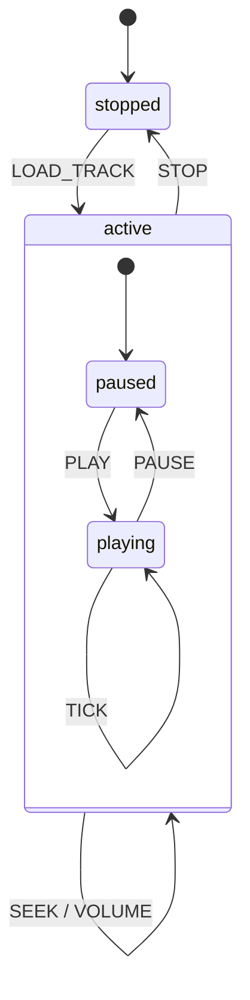

# Step 4: Media Player (Hierarchical States)

A media player demonstrating hierarchical/nested states - the `active` state contains `playing` and `paused` child states.

## Run

```bash
cd tutorial/step4_hierarchical
flutter run -d chrome
```

## Concepts Introduced

- **Compound States** - States that contain child states
- **Nested States** - Children inherit parent transitions
- **Initial Child State** - Default state when entering a compound state
- **Dot Notation** - Targeting nested states (e.g., `active.playing`)
- **Parent Entry/Exit Actions** - Actions that run for the compound state

## How to Use

1. Click **Play** to load a sample track (enters `active.paused`)
2. Click **Play** again to start playback (`active.playing`)
3. Click **Pause** to pause (`active.paused`)
4. Click **Stop** to return to `stopped` state
5. Use the track list to load different songs
6. Use the seek slider to change position
7. Click **Fast Forward** to simulate time passing

## State Machine Structure



```
player
├── stopped (initial)
│   └── LOAD_TRACK → active.paused
└── active (compound)
    ├── entry: [log "Entered active state"]
    ├── exit: [log "Exited active state"]
    ├── STOP → stopped (available in ANY child)
    ├── LOAD_TRACK → active.paused (available in ANY child)
    ├── SEEK → (self, available in ANY child)
    ├── VOLUME → (self, available in ANY child)
    ├── playing
    │   ├── PAUSE → active.paused
    │   └── TICK → (self, advance position)
    └── paused (initial)
        └── PLAY → active.playing
```

## Code Highlights

### Defining Compound States

```dart
..state('active', (s) => s
  ..initial('paused')  // Default child when entering 'active'

  // Parent-level transitions (available in ALL children)
  ..on<StopEvent>('stopped')
  ..on<SeekEvent>(null, actions: [...])  // null target = self-transition

  // Child states
  ..state('playing', (child) => child
    ..on<PauseEvent>('active.paused')
  )
  ..state('paused', (child) => child
    ..on<PlayEvent>('active.playing')
  )
)
```

### Targeting Nested States

```dart
// From outside, target a specific nested state
..on<LoadTrackEvent>('active.paused', actions: [...])

// From inside, transition between siblings
..on<PlayEvent>('active.playing')
..on<PauseEvent>('active.paused')
```

### Checking Nested State

```dart
state.value.matches('active')          // true if in active OR any child
state.value.matches('active.playing')  // true only if in playing
state.value.matches('active.paused')   // true only if in paused
```

### Parent Entry/Exit Actions

```dart
..state('active', (s) => s
  ..entry([
    (ctx, _) {
      debugPrint('Entered active state');
      return ctx;
    },
  ])
  ..exit([
    (ctx, _) {
      debugPrint('Exited active state');
      return ctx;
    },
  ])
  // ...children...
)
```
