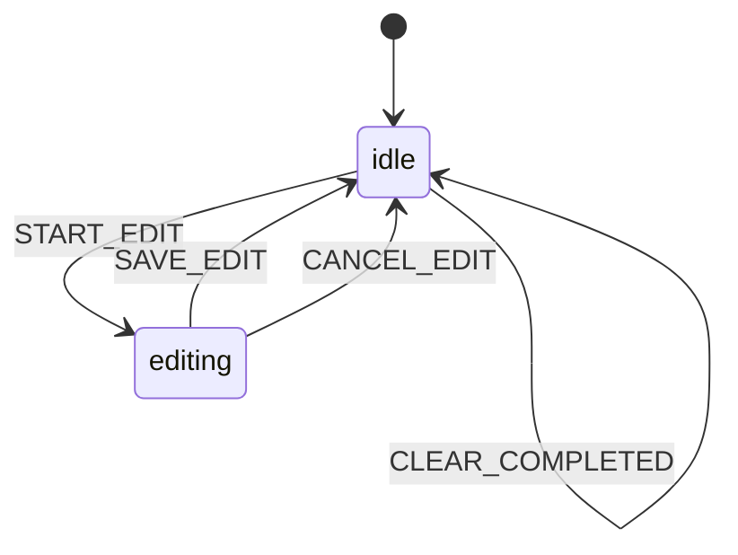

# Step 5: Todo App

A full todo application demonstrating Flutter widget integration patterns.

## Run

```bash
cd tutorial/step5_todo
flutter run -d chrome
```

## Concepts Introduced

- **StateMachineProvider** - Providing the actor to the widget tree
- **StateMachineBuilder** - Rebuilding UI on any state/context change
- **StateMachineSelector** - Only rebuilding when selected value changes
- **buildWhen** - Conditional rebuilding for performance
- **Modal State** - Using state machine for UI modes (idle vs editing)

## How to Use

1. Type a todo and press Enter or click **+** to add
2. Click the checkbox to toggle completion
3. Click the edit icon to enter edit mode
4. Click delete to remove a todo
5. Use **Clear completed** to remove all completed items

## State Machine Structure



```
todo
├── idle (initial)
│   ├── ADD_TODO → idle (action: add item)
│   ├── REMOVE_TODO → idle (action: remove item)
│   ├── TOGGLE_TODO → idle (action: toggle completion)
│   ├── START_EDIT → editing (action: set editingId)
│   └── CLEAR_COMPLETED → idle (action: filter items)
└── editing
    ├── SAVE_EDIT → idle (action: update item, clear editingId)
    └── CANCEL_EDIT → idle (action: clear editingId)
```

## Code Highlights

### StateMachineBuilder - Full Rebuilds

```dart
StateMachineBuilder<TodoContext, TodoEvent>(
  builder: (context, state, send) {
    final items = state.context.items;
    // Rebuilds on ANY change to state or context
    return ListView.builder(...);
  },
)
```

### StateMachineSelector - Selective Rebuilds

```dart
// Only rebuilds when the selected value changes
StateMachineSelector<TodoContext, TodoEvent, String>(
  selector: (ctx) => '${ctx.completedCount}/${ctx.totalCount}',
  builder: (context, stats, send) {
    return Text(stats);  // Only rebuilds when counts change
  },
)
```

### buildWhen - Conditional Rebuilds

```dart
StateMachineBuilder<TodoContext, TodoEvent>(
  buildWhen: (previous, current) =>
      previous.value.matches('editing') != current.value.matches('editing'),
  builder: (context, state, send) {
    // Only rebuilds when entering/exiting editing state
    if (!state.value.matches('editing')) {
      return const SizedBox.shrink();
    }
    return EditingOverlay(...);
  },
)
```

### Context with Computed Properties

```dart
class TodoContext {
  final List<TodoItem> items;
  final String? editingId;

  int get totalCount => items.length;
  int get completedCount => items.where((i) => i.completed).length;
  int get pendingCount => items.where((i) => !i.completed).length;
}
```
