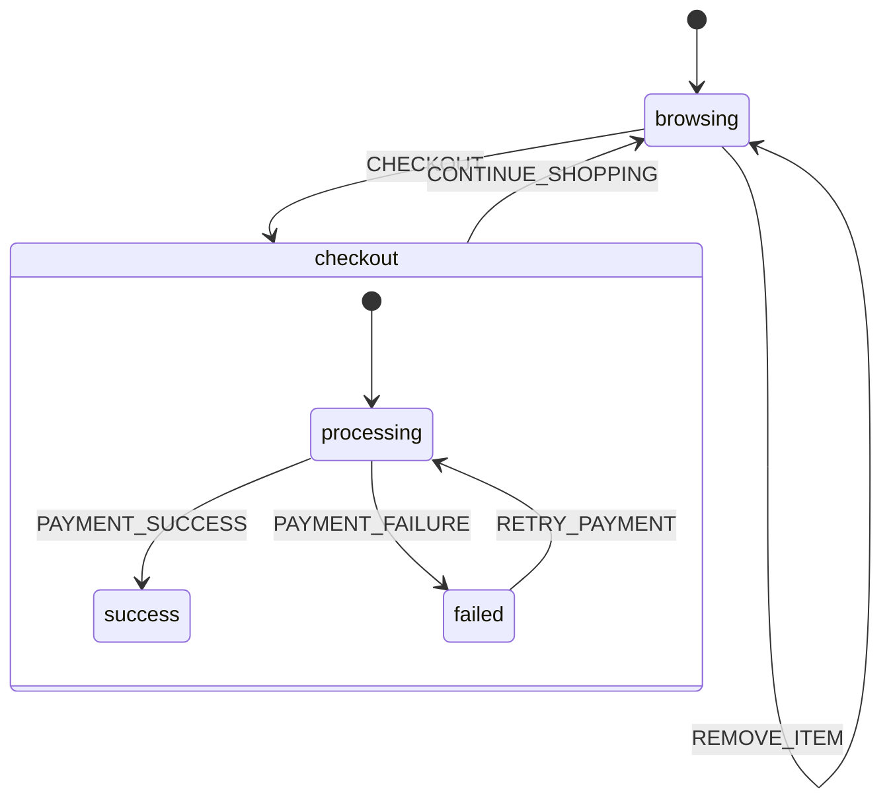

# Step 7: Inspector Panel

This tutorial demonstrates the **StateMachineInspectorPanel** - a visual debugging tool for state machines.

## Run

```bash
cd tutorial/step7_inspector
flutter run -d chrome
```

## Features Demonstrated

- **StateMachineInspectorPanel** - Visual debugging widget
- **State Tree View** - See all states with current state highlighted
- **Transition History** - Timeline of all state transitions
- **Context View** - Live view of the context data
- **Stats View** - Event counts and transition statistics
- **Event Sender** - Send events directly to the state machine

## How to Use

### 1. Browse Products
Click product chips to add items to your cart. The state machine stays in `browsing` state.

### 2. Checkout
Click the **Checkout** button. The state transitions to `checkout.processing`.

### 3. Simulate Payment Result
The processing state waits for a payment result. **Use the Inspector Panel** to send the result:

1. Click the **Events** tab in the inspector
2. Click **PAYMENT_SUCCESS** to complete the order, or
3. Click **PAYMENT_FAILURE** to simulate a failed payment

This demonstrates the inspector's ability to send events for testing and debugging.

### 4. Continue
- After success: Cart is cleared, click **Continue Shopping**
- After failure: Click **Retry Payment** or **Continue Shopping**

## State Machine Structure



```
cart (compound)
├── browsing (initial)
│   └── handles: ADD_ITEM, REMOVE_ITEM, CHECKOUT, etc.
└── checkout (compound)
    ├── processing (initial)
    │   └── handles: PAYMENT_SUCCESS, PAYMENT_FAILURE
    ├── success
    │   └── handles: CONTINUE_SHOPPING
    └── failed
        └── handles: RETRY_PAYMENT, CONTINUE_SHOPPING
```

## Inspector Panel Tabs

| Tab | Description |
|-----|-------------|
| **States** | Visual state tree with current state highlighted in green |
| **History** | Timeline of transitions showing from → to states |
| **Context** | Live display of the context object (cart items, totals) |
| **Stats** | Event counts, state visit counts, transition metrics |
| **Events** | Buttons to send events directly to the state machine |

## Code Highlights

### Setting up the Inspector Panel

```dart
StateMachineInspectorPanel<CartContext, CartEvent>(
  actor: actor,
  machine: cartMachine,
  eventBuilders: {
    'ADD_ITEM': () => AddItemEvent(testItem),
    'CHECKOUT': () => CheckoutEvent(),
    'PAYMENT_SUCCESS': () => PaymentSuccessEvent(),
    'PAYMENT_FAILURE': () => PaymentFailureEvent('Card declined'),
  },
)
```

### Using InspectorOverlay (Alternative)

For a floating debug button instead of a side panel:

```dart
InspectorOverlay<MyContext, MyEvent>(
  actor: actor,
  machine: machine,
  child: MyApp(),
)
```

## Promo Codes

Try these promo codes in the browsing state:
- `SAVE10` - 10% discount
- `SAVE20` - 20% discount
