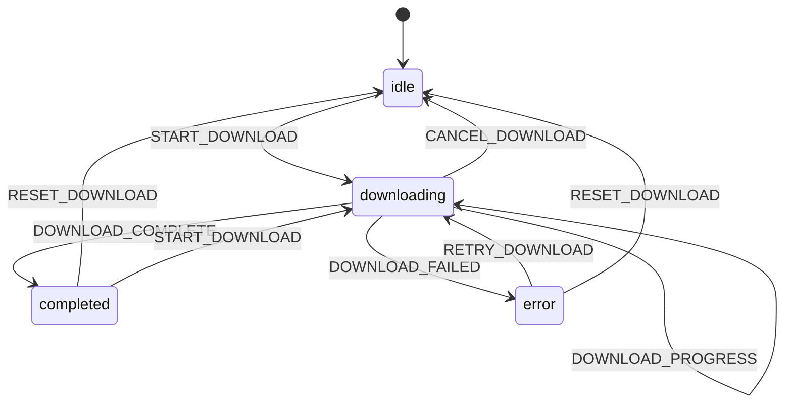
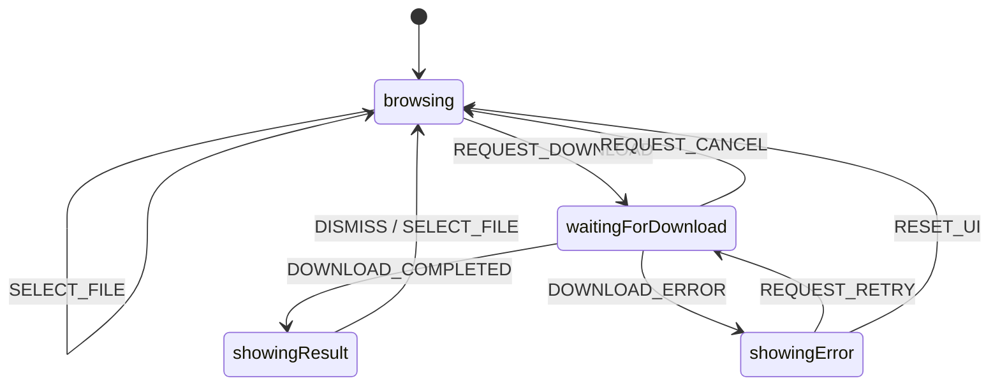

# Step 8: Multi-Machine Communication

Two separate state machines running simultaneously and communicating with each other: a Download Manager and a UI Controller.

## Run

```bash
cd tutorial/step8_multi_machine
flutter run -d chrome
```

## Concepts Introduced

- **Multiple State Machines** - Running two independent machines simultaneously
- **Inter-Machine Communication** - Machines sending events to each other
- **Coordinator Pattern** - Central coordinator managing machine communication
- **Separation of Concerns** - Download logic separate from UI logic
- **Event Notifications** - One machine notifying another of state changes

## How to Use

1. Select a file from the list (click a chip)
2. Click **Start Download** to begin
3. Watch the download progress - both state indicators update
4. When complete, the UI machine receives a notification
5. Try the file marked with a warning to see error handling
6. Use **Cancel**, **Retry**, or **Reset** as needed

## Architecture

### Two State Machines

```
┌─────────────────────┐      ┌─────────────────────┐
│   Download Machine  │      │     UI Machine      │
├─────────────────────┤      ├─────────────────────┤
│ States:             │      │ States:             │
│ - idle              │      │ - browsing          │
│ - downloading       │◄────►│ - waitingForDownload│
│ - completed         │      │ - showingResult     │
│ - error             │      │ - showingError      │
└─────────────────────┘      └─────────────────────┘
         ▲                            │
         │    MachineCoordinator      │
         └────────────────────────────┘
```

### Communication Flow

```
1. User selects file
   UI: browsing → (SelectFileEvent) → browsing

2. User clicks download
   UI: browsing → (RequestDownloadEvent) → waitingForDownload
   Coordinator sends: StartDownloadEvent to Download Machine
   Download: idle → downloading

3. Download progresses
   Download: downloading → (DownloadProgressEvent) → downloading
   (UI observes via listener)

4. Download completes
   Download: downloading → completed
   Coordinator observes completion, sends: DownloadCompletedNotification to UI
   UI: waitingForDownload → showingResult

5. User resets
   UI: showingResult → browsing
   Download: completed → idle
```

## State Machine Structures

### Download Machine



```
download
├── idle (initial)
│   └── START_DOWNLOAD → downloading
├── downloading
│   ├── DOWNLOAD_PROGRESS → (self, update progress)
│   ├── DOWNLOAD_COMPLETE → completed
│   ├── DOWNLOAD_FAILED → error
│   └── CANCEL_DOWNLOAD → idle
├── completed
│   ├── RESET_DOWNLOAD → idle
│   └── START_DOWNLOAD → downloading
└── error
    ├── RETRY_DOWNLOAD → downloading
    └── RESET_DOWNLOAD → idle
```

### UI Machine



```
ui
├── browsing (initial)
│   ├── SELECT_FILE → (self, update selection)
│   └── REQUEST_DOWNLOAD → waitingForDownload (guard: file selected)
├── waitingForDownload
│   ├── REQUEST_CANCEL → browsing
│   ├── DOWNLOAD_COMPLETED_NOTIFICATION → showingResult
│   └── DOWNLOAD_ERROR_NOTIFICATION → showingError
├── showingResult
│   ├── DISMISS_DIALOG → browsing
│   └── SELECT_FILE → browsing
└── showingError
    ├── REQUEST_RETRY → waitingForDownload
    └── RESET_UI → browsing
```

## Code Highlights

### Creating Multiple Machines

```dart
// Each machine is independent with its own context and events
StateMachine<DownloadContext, DownloadEvent> createDownloadMachine() { ... }
StateMachine<UIContext, UIEvent> createUIMachine() { ... }

// Create actors for both
downloadActor = createDownloadMachine().createActor();
uiActor = createUIMachine().createActor();

// Start both
downloadActor.start();
uiActor.start();
```

### Inter-Machine Communication via Listener

```dart
// Download machine notifies UI machine when state changes
downloadActor.addListener(() {
  final downloadState = downloadActor.snapshot;

  if (downloadState.value.matches('completed')) {
    final filename = downloadState.context.filename ?? 'unknown';
    uiActor.send(DownloadCompletedNotification(filename));
  }

  if (downloadState.value.matches('error')) {
    final error = downloadState.context.error ?? 'Unknown error';
    uiActor.send(DownloadErrorNotification(error));
  }
});
```

### Coordinator Pattern

```dart
class MachineCoordinator {
  late final StateMachineActor<DownloadContext, DownloadEvent> downloadActor;
  late final StateMachineActor<UIContext, UIEvent> uiActor;

  void initialize() {
    downloadActor = createDownloadMachine().createActor();
    uiActor = createUIMachine().createActor();

    // Set up communication bridges
    _setupDownloadToUIBridge();

    downloadActor.start();
    uiActor.start();
  }

  // UI actions that affect download machine
  void startDownload(String filename, String url) {
    downloadActor.send(StartDownloadEvent(url: url, filename: filename));
  }
}
```

### Separation of Concerns

```dart
// Download machine only cares about download logic
sealed class DownloadEvent extends XEvent {}
class StartDownloadEvent extends DownloadEvent { ... }
class DownloadProgressEvent extends DownloadEvent { ... }
class DownloadCompleteEvent extends DownloadEvent { ... }

// UI machine only cares about UI state
sealed class UIEvent extends XEvent {}
class SelectFileEvent extends UIEvent { ... }
class RequestDownloadEvent extends UIEvent { ... }
class DownloadCompletedNotification extends UIEvent { ... }  // From download machine
```

## Alternative: Using ActorSystem

For more complex scenarios, use `ActorSystem` with `sendTo` actions:

```dart
final system = ActorSystem();

// Spawn machines within the system
final downloadRef = system.spawn(
  id: 'download',
  machine: createDownloadMachine(),
);

final uiRef = system.spawn(
  id: 'ui',
  machine: createUIMachine(),
);

// Use sendTo action in machine definition
..on<DownloadCompleteEvent>('completed', actions: [
  sendTo('ui', DownloadCompletedNotification('file.pdf')),
])
```

## When to Use Multiple Machines

- **Separation of Concerns**: Download logic shouldn't know about UI states
- **Independent Lifecycles**: One machine can restart without affecting the other
- **Testability**: Test download logic without UI, test UI without real downloads
- **Reusability**: Download machine can be used with different UIs
- **Complex Coordination**: Multiple async processes that need to communicate
