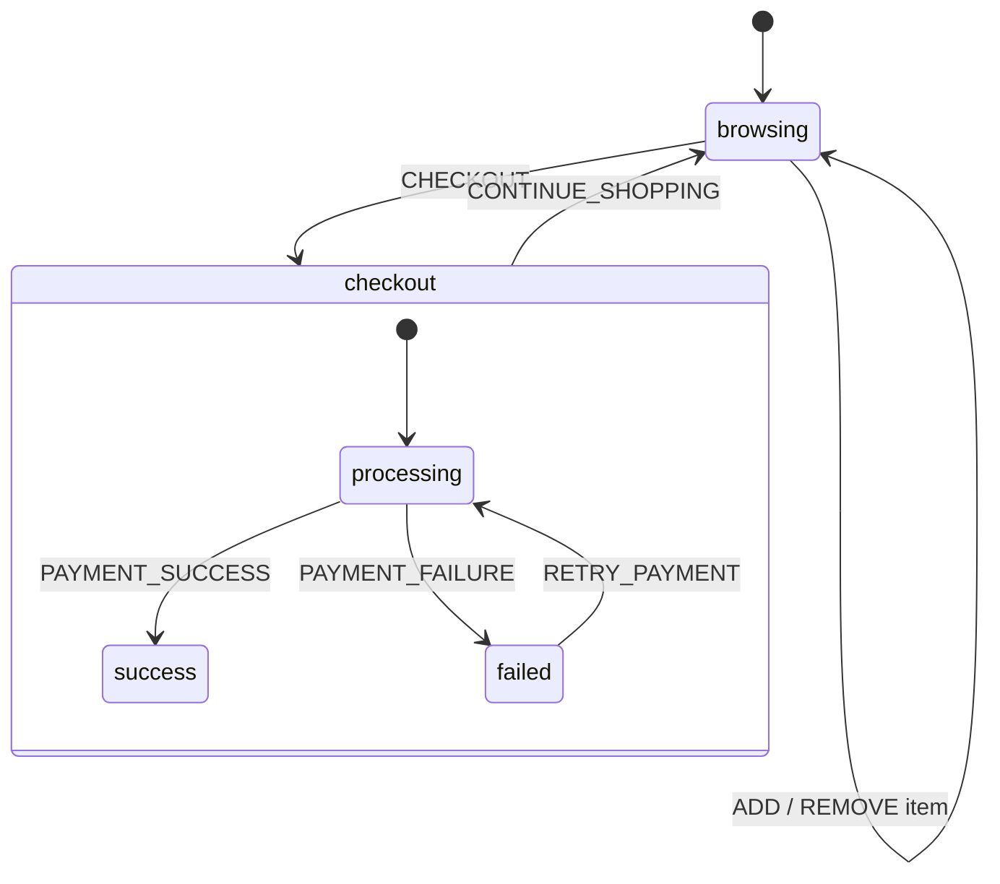

# Step 9: Structured Project Organization

This tutorial demonstrates best practices for organizing state machine code in larger projects.

## Run

```bash
cd tutorial/step9_structured
flutter run -d chrome
```

## Key Concepts

This is a refactored version of Step 7 (Inspector), with the single `main.dart` split into a clean file structure.

### State Machine Structure



### File Structure

```
lib/
├── main.dart                      # App entry point only
├── machine/
│   ├── cart_machine.dart          # Assembles machine from parts
│   ├── models/
│   │   ├── cart_item.dart         # CartItem model
│   │   └── cart_context.dart      # CartContext model
│   ├── events/
│   │   └── cart_events.dart       # All event classes
│   ├── states/
│   │   ├── browsing_state.dart    # buildBrowsingState()
│   │   └── checkout/              # Compound state subfolder
│   │       ├── checkout_state.dart
│   │       ├── processing_state.dart
│   │       ├── success_state.dart
│   │       └── failed_state.dart
│   ├── actions/
│   │   └── cart_actions.dart      # Static action methods
│   └── guards/
│       └── cart_guards.dart       # Static guard methods
└── widgets/
    ├── widgets.dart               # Barrel export
    ├── inspector_demo_screen.dart
    ├── cart_view.dart
    └── ...                        # Other UI components
```

## Patterns Demonstrated

### 1. States as Callback Functions

Each state is defined as a function that configures a `StateBuilder`:

```dart
// states/browsing_state.dart
void buildBrowsingState(StateBuilder<CartContext, CartEvent> s) {
  s
    ..on<AddItemEvent>(null, actions: [CartActions.addItem])
    ..on<RemoveItemEvent>(null, actions: [CartActions.removeItem])
    ..on<CheckoutEvent>('checkout.processing', guard: CartGuards.hasItems);
}
```

### 2. Compound States in Subfolders

The `checkout` compound state has its children in a dedicated folder:

```dart
// states/checkout/checkout_state.dart
void buildCheckoutState(StateBuilder<CartContext, CartEvent> s) {
  s
    ..initial('processing')
    ..on<ContinueShoppingEvent>('browsing')  // Parent-level handler
    ..state('processing', buildProcessingState)
    ..state('success', buildSuccessState)
    ..state('failed', buildFailedState);
}
```

### 3. Actions as Static Methods

Actions are grouped in a class for reusability:

```dart
// actions/cart_actions.dart
abstract final class CartActions {
  static CartContext addItem(CartContext ctx, CartEvent event) {
    final e = event as AddItemEvent;
    // ... add item logic
    return ctx.copyWith(items: [...ctx.items, e.item]);
  }

  static CartContext clearCart(CartContext ctx, CartEvent _) {
    return ctx.copyWith(items: [], clearPromo: true, discount: 0);
  }
}
```

### 4. Guards as Static Methods

Guards are similarly organized:

```dart
// guards/cart_guards.dart
abstract final class CartGuards {
  static bool hasItems(CartContext ctx, CartEvent _) {
    return ctx.items.isNotEmpty;
  }
}
```

### 5. Machine Assembly

The machine definition becomes clean and declarative:

```dart
// cart_machine.dart
final cartMachine = StateMachine.create<CartContext, CartEvent>(
  (m) => m
    ..context(const CartContext())
    ..initial('browsing')
    ..state('browsing', buildBrowsingState)
    ..state('checkout', buildCheckoutState),
  id: 'cart',
);
```

## Benefits

- **Separation of concerns** - Models, events, states, actions, guards, widgets in dedicated folders
- **Reusability** - Actions and guards can be shared across states
- **Testability** - Each piece can be unit tested in isolation
- **Scalability** - Easy to add new states, events, or actions
- **Discoverability** - File structure mirrors the state machine structure

## When to Use This Pattern

- Projects with more than 2-3 states
- State machines with complex actions or guards
- Teams working on the same codebase
- When you want to unit test state machine logic separately

## Promo Codes

Try these promo codes in the browsing state:
- `SAVE10` - 10% discount
- `SAVE20` - 20% discount
